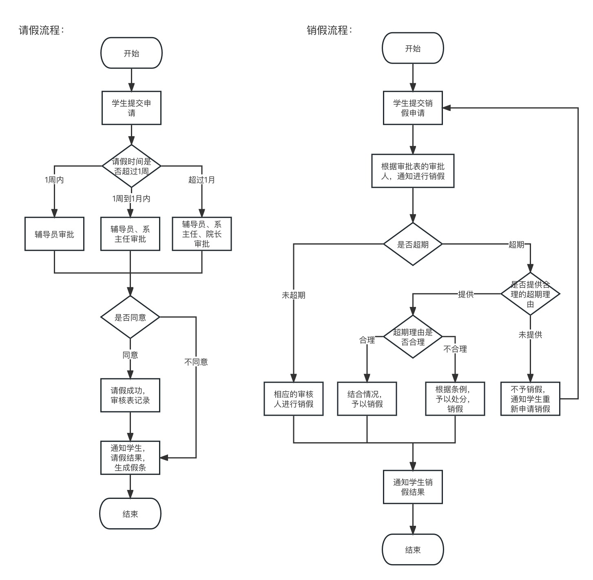
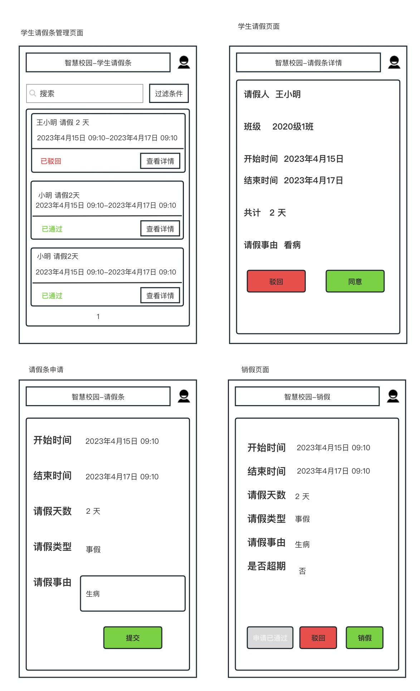

### 题1
问题：数据库设计，您可以选择使用 Django ORM、SQL 语句、ER 图、自然语言或其它您认为我能理解的格式来回答，主要考察逻辑而非语法细节。分为三个难度级别，您可以根据自己的能力选择一种来回答。 
题目背景：作为学生的你一定很了解学校的请假流程，现在请你尝试将请假的流程数字化，需要完成提交申请、 审核、销假的流程，你只需要完成这个流程的数据库设计，无需考虑其它。 
Easy: 学生提交请假申请 > 辅导员审核（同意，拒绝） > 销假； 
Medium: 在 Easy 的基础上，增加一级学院领导审核；
Hard: 在 Medium 的基础上，以工作流的模式，实现任意级别的审核流程；

```txt
学生表(Student)：用于存储学生的个人信息，如学号、姓名、班级、联系方式等。
字段：id, student_id, name, class, contact

请假申请表(LeaveApplication)：用于存储学生提交的请假申请信息，如请假开始时间、结束时间、请假事由等。
字段：id, student_id, start_time, end_time, reason, status

审核记录表(AuditRecord)：用于存储审核记录，包括审核人、审核时间、审核意见等。
字段：id, leave_application_id, auditor, audit_time, audit_opinion

    其中，审核状态(status)字段可以用数字表示，如0表示未审核，1表示审核通过，2表示审核拒绝。学生提交请假申请时，会在请假申请表中创建一条记录，审核通过后，审核状态会被修改为1，审核拒绝则会被修改为2。销假操作可以直接在请假申请表中修改相应的字段。

辅导员表(Teacher)：用于存储辅导员的个人信息，如姓名、职称、联系方式等。
字段：id, name, title, contact

学院表(College)：用于存储学院的信息，如学院名称、院长姓名、联系方式等。
字段：id ,name, dean, contact

在此基础上，可以重新设计审核记录表(AuditRecord)，增加审核顺序字段(order)，用于记录审核流程的顺序。每一次审核后，会在审核记录表中创建一条记录，记录审核人、审核时间、审核意见、审核顺序等信息。在审核通过或审核拒绝时，会根据审核顺序自动进入下一个审核环节。当所有审核环节完成后，审核状态会被修改为1，否则为0。

```


### 题2


### 题3
前端开发，您一定使用过百度搜索，下图为一个精简版的搜索页面，请尝试实现它。您只需要写出关键的 html、 css 即可。加分项：使用 FLEX 布局实现。

参考 `BaiduHomePage` 内容

### 题4
##### 题a
```python
# Flask版本 
from flask import Flask

app = Flask(__name__)

@app.route('/ping/', methods=['GET'])
def ping():
    return 'pong'

# Flask-Restful
from flask import Flask
from flask_restful import Api, Resource

app = Flask(__name__)
api = Api(app)

class Ping(Resource):
    def get(self):
        return 'pong'

api.add_resource(Ping, '/ping/')

# FastAPI
from fastapi import FastAPI

app = FastAPI()

@app.get('/ping/')
async def ping():
    return 'pong'
```

##### 题b
```python
# Flask实现
from flask import Flask, request, jsonify
from datetime import datetime
import pytz

app = Flask(__name__)

@app.route('/date/', methods=['GET'])
def get_date():
    timezone = request.args.get('tz', '')
    if timezone == 'Asia/Shanghai':
        now = datetime.now(pytz.timezone(timezone)).strftime('%Y-%m-%d %H:%M:%S')
        response = {'status': 'success', 'date': now}
    else:
        response = {'status': 'error'}
    return jsonify(response)

if __name__ == '__main__':
    app.run(debug=True)


#Flask-Restful
from flask import Flask
from flask_restful import Api, Resource, reqparse
from datetime import datetime
import pytz

app = Flask(__name__)
api = Api(app)

class Date(Resource):
    def get(self):
        parser = reqparse.RequestParser()
        parser.add_argument('tz', type=str, required=True)
        args = parser.parse_args()
        timezone = args.get('tz')
        if timezone == 'Asia/Shanghai':
            now = datetime.now(pytz.timezone(timezone)).strftime('%Y-%m-%d %H:%M:%S')
            response = {'status': 'success', 'date': now}
        else:
            response = {'status': 'error'}
        return response

api.add_resource(Date, '/date/')

if __name__ == '__main__':
    app.run(debug=True)

# FastAPI
from fastapi import FastAPI, HTTPException
from datetime import datetime
import pytz

app = FastAPI()

@app.get('/date/')
async def get_date(tz: str):
    if tz == 'Asia/Shanghai':
        now = datetime.now(pytz.timezone(tz)).strftime('%Y-%m-%d %H:%M:%S')
        response = {'status': 'success', 'date': now}
    else:
        raise HTTPException(status_code=400, detail='Invalid timezone')
    return response
```

##### 题c
```python
from flask import Flask, request, jsonify
from datetime import datetime
from collections import defaultdict
import json
import sqlite3

app = Flask(__name__)

def get_total_market_value_by_product(conn, product):
    cursor = conn.cursor()
    query = f"SELECT strftime('%Y', ValuedDate) AS year, SUM(MarketValue) AS total_market_value FROM cost WHERE Product='{product}' GROUP BY year"
    cursor.execute(query)
    results = cursor.fetchall()
    return {year: market_value for year, market_value in results}

def get_total_market_value_by_year(conn):
    cursor = conn.cursor()
    query = "SELECT Product, strftime('%Y', ValuedDate) AS year, SUM(MarketValue) AS total_market_value FROM cost GROUP BY Product, year"
    cursor.execute(query)
    results = cursor.fetchall()
    products = defaultdict(dict)
    for product, year, market_value in results:
        products[product][year] = market_value
    return products

@app.route('/cost/', methods=['GET'])
def get_cost():
    product = request.args.get('product', '')
    conn = sqlite3.connect('database.db')
    if product:
        response = get_total_market_value_by_product(conn, product)
    else:
        response = get_total_market_value_by_year(conn)
    conn.close()
    return jsonify(response)

if __name__ == '__main__':
    app.run(debug=True)


```